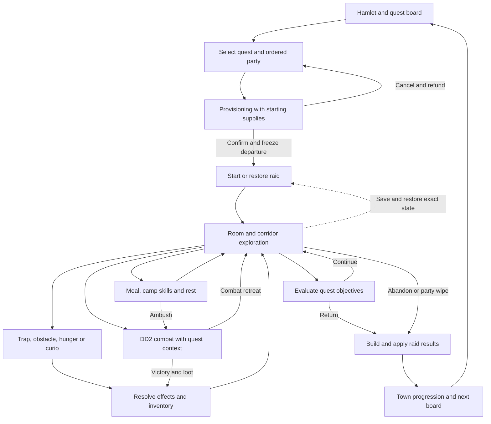

# DD1 quest lifecycle and DD2 implementation map

Owner direction, 2026-10-08: reverse engineer the full base-game quest flow, then implement the equivalent quest
systems inside DD2. This replaces waiting for an R1-R10 ranking. DD2 regions and native DD2 combat remain the design.

This document maps the whole lifecycle, including cancellation, failure and recovery. It does not claim that every
rule or native UI interaction already matches. The native engine takes precedence where the Unity reference differs.

## Evidence and identity

- Installed DD1 win64 executable SHA-256: `4d78fbfaa65b7d002d2208d02da809200f4a5723119521180e30100d6f1a75f2`.
- Native analysis, C bodies and raw facts remain private at `D:/dd1-decomp`; query with [dd1re](dd1re/README.md).
- Installed DD1 data: `C:/Program Files (x86)/Steam/steamapps/common/DarkestDungeon`.
- Unity reference: `C:/Users/Piral/csharpdd/Darkest-Dungeon-Unity/Assets/Scripts`.
- DD2 managed reference: `C:/Users/Piral/dd2-decomp/IronCrown`; use [REA](rea_usage.md) for CIL/build questions.
- Native addresses below identify inspected bodies and their callers. Descriptions are our paraphrases. Static
  evidence establishes code paths, not an observed game session. Runtime integration remains subject to the no-launch rule.
- A missing string reference alone does not establish an unused rule. Follow its loader, stored value and consumers.

## Flow

## Phase contracts

`Confirmed` means native static code was followed, with data/source corroboration where available. `Partial` means
the phase is located but specified predicates or branches remain unresolved. Test names below are existing coverage
unless the implementation ledger records a new regression; they do not prove native DD2 presentation.

| ID | Native contract and evidence | DD2 mod seam / tests | Remaining work |
|---|---|---|---|
| Q01 | **Partial:** selected quest lives in campaign state. Town advance `1406d5d30` calls preparation questions `140809950` before provisioning. | `QuestBoard`, `EmbarkUi.SelectQuest`; `CampaignTests`, `CampaignRegionTests` | Exact guard precedence; distinguish ordinary quest warnings from Circus hard restrictions. |
| Q02 | **Confirmed:** provision entry `140688a50` populates party supplies `140571510`, then store supplies `140571bd0`. Data supplies length/class/goal items. | `Provisioner`, `Embark.Create`, `EmbarkUi`; `QuestGoalTests` | Show free supplies during preparation; enforce combined pack capacity. |
| Q03 | **Confirmed:** provision question `1406ca880` counts food against length thresholds and obeys the plot warning flag. | `Provisioner.MinimumFood`, `EmbarkUi` | Import `has_provision_warnings`; remove unsupported no-torch confirmation. |
| Q04 | **Confirmed:** cancellation `1406dc0c0` -> `1406dc1c0` -> `1406d3e30` refunds tracked spend and clears both provision inventories before quest selection. | `EmbarkUi` back control; `ExpeditionRecoveryTests` cover a different, failed-host refund | Clear staged purchases on cancellation; add a real cancellation regression. |
| Q05 | **Confirmed:** town-finish app state `1403d93c0` calls `14054d9f0` to freeze quest, party, pack and cost before town mutations `1403d7400`. | `Driver.Embark`, `Embark.Create`, `ExpeditionState` | Stop departure when persistence fails; define complete failed-host rollback. Native disk-save position remains partial. |
| Q06 | **Confirmed:** raid start `1403d44b0` initializes loot, restores or creates raid, invokes pre-start, `140600370`, then party start `1405f7170`. | `Dd2Run`, `Driver.OnRoadReady`, `Crawl.Begin/Resume`; `RunRecoveryTests`, `CrawlResumeTests` | Preserve restore/fresh-start distinction; native entrance scout details remain partial. |
| Q07 | **Confirmed:** corridor entry `140763be0` chooses orientation and regenerates return contents when entering an explored corridor. | `Crawl.Travel/Step`, mutable `DungeonMap`; `CrawlTests` | Regenerate wandering contents on corridor re-entry, with darkness modifiers, rather than every repeated square. |
| Q08 | **Confirmed:** tile advance `140768820` applies hallway stress before torch loss, then effects/actouts, death check, temptation and contents. `1405f98b0` uses a raw chance then `1405f9c70` selects one uniform hero. | `Crawl.EnterTile/HallwayStress`; `HallwayStressTests`, `CrawlTests` | Selection, forward-empty/backing gates and pre-light ordering implemented round 165. Individual hero stress modifiers, plot overrides and native presentation remain open. |
| Q09 | **Confirmed:** room knowledge/scouting `1405f9920` includes hero attributes and torch, and decrements hunger room buffer. | `Crawl.EnterRoom/Scout`; `ScoutingTests`, `SecretBranchTests` | Hero scouting modifiers and native draw classification; entrance suppression initialization remains unresolved. |
| Q10 | **Confirmed:** content dispatch `140766c20` distinguishes ordinary battle from forced ambush. Surprise `1405fe3d0` uses one weighted pick. Matching saved battle reuses its snapshot. | `Crawl.EmitBattle`, `Driver.Handle`, `Dd2Combat.Start`; `SurpriseTests`, `FightCheckpointTests` | Round159 implements ordinary weights, pending DD1 buffs and roaming flags. Plot/formation special gates need further tracing. |
| Q11 | **Confirmed:** hunger content is gated by saved room buffer; overlay `140705c10` offers Eat/Starve and computes modified food need. Effects `140707780` / `140706390` then resolve. | `Crawl.HungerCheck`, `ExpeditionState`; `CrawlTests` | Persistent hunger choice and buffer, food modifiers and actor refusal. Current mod resolves automatically. |
| Q12 | **Partial:** prop interaction `140768320` installs event overlay `140706700`; completion checks hero death before clearing the event. | `InteractCurio`, trap/obstacle actions, `PendingCurio`; `SavedCurioTests`, `CurioActorTests` | Follow full result callbacks/target selection; block Core movement and camp while unresolved modal reports exist. |
| Q13 | **Confirmed:** inventory/loot must resolve before ordinary event completion. Native result application separates carried inventory from success rewards. | `PendingSpoils`, `TakeLeftBehind`, required-loot exit guards; `SavedSpoilsTests`, `GatherLootTests`, `ExpeditionExitTests` | Wipe-specific inventory routing remains partial; apply objective checks after actual pickup. |
| Q14 | **Confirmed:** camp controller `1406fbb90` adds camp_restore_torch through `1406091a0` before meals/skills; provisions `1406fc330` / `1406fd890` apply modified ration cost and effects. | `MakeCamp`, `EatMeal`, `UseCampSkill`, `BreakCamp`; `CampLightTests`, `CampingTests`, `SavedMealTests` | Torch timing implemented round 164, preserving saved later skill changes. Food modifiers/refusal and ambush-rest callback remain partial. |
| Q15 | **Confirmed:** explore goal start `14057a740` uses nonzero explicit amount, otherwise truncates ordinary room count × percentage down; excludes secret-door rooms. | `Crawl.CheckQuest`/`ExploreRoomTarget`, `CrawlUi.GoalText`, `DungeonMap.QuestRooms`; `ExploreGoalTests`, `QuestGoalTests` | Predicate implemented round 160 and HUD shares it in round 162; native completion crest/continued traversal awaits play verification. |
| Q16 | **Confirmed:** gather predicate `14057a930` checks matching quest items currently held; activate `140579e10` checks persistent activation count. | `InteractQuestCurio`, `CheckQuest`, `TakeLeftBehind`, `QuestCurioProgress`, `CrawlUi`; `GatherLootTests`, `SavedCurioTests`, `CurioActorTests` | Implemented round 163 after correcting incomplete carried-item fixtures. Completion/report/HUD count held items; pickup reevaluates and announces completion. Native modal/banner behavior awaits play. |
| Q17 | **Confirmed:** kill goal `14057a9d0` subscribes requested monster IDs; tutorial predicate `14057adf0` requires current target room with no battle. | `ResolveBattle`, `CheckQuest`, `QuestGoal.MonsterClasses`; `PlotMapTests`, `QuestGoalTests` | Track matching kills; avoid accepting merely past tutorial-room visits. |
| Q18 | **Partial:** completion crest `140741fb0` waits for objective and battle/event/camp/presentation gates, then offers continue or finish. | `QuestComplete`, `TryLeave`, `Driver.Leave`; `ExpeditionExitTests` | Complete modal/camp guards and saved completion presentation. Continue exploring must remain possible. |
| Q19 | **Confirmed:** results builder `140603520` separates success, surviving party and town-progress eligibility. `1403d5370` dispatches pre-result notification before application. | `Homecoming.Report`, `Driver.CompleteHomecoming`; `ExpeditionRecoveryTests`, `MemorialTests` | Resolve failed-return town eligibility and wipe inventory path before generalizing return processing. |
| Q20 | **Confirmed:** campaign application `14054d0d0` applies success rewards, carried inventory, roster results, event bookkeeping and progression. | `Homecoming.Report`; `LoopTests`, `TrinketLootTests`, `CampaignJournalTests` | Distinct finished/success counters; plot zone-XP flags; native survivor XP bonus rounding and cap. |
| Q21 | **Confirmed with gate uncertainty:** roster return `14057cb40` ages old party quirks, locks eligible negatives, then applies new return awards. Builder `140603520` generates awards for the party beforehand. | `HeroRecord`, `Homecoming`, `QuirkLimits`; `QuirkLimitTests` | Persistent age, weighted compatible return pool, effective disease resistance, native RNG order and return eligibility. |
| Q22 | **Confirmed:** `1403dddd0` calls raid finish before town start `14054d3e0`; event `14058b850` and board `140572f40` use town-progress eligibility. | `Hamlet.EndWeek/RefreshWeek`, `Driver`; `HamletTests`, `CampaignTests` | Split away-activity resolution from post-return board/event generation. Current generation happens too early at embark. |
| Q23 | **Confirmed:** save routines `140601390`, `1405f9f60`, `1405973e0`, `1405bbd60` retain position, party/pack, hunger buffer, knowledge, goal, camp and battle state. | `SaveFile`, `ExpeditionState`, pending reports/checkpoint; resume/recovery suites | Add state for missing modal/buffer/progression contracts. Full native save timing and finish replay require further tracing. |

## Rules recovered beyond the phase graph

### Surprise

For an ordinary encounter, add base, torch and active hero modifiers, then clamp each side to its configured cap.
For a lone hero, zero the party **base** before modifiers. None has weight `clamp(1-party-monsters, .25, 1)`.
Draw once in order none, party, monsters over the total. At side weights `.65/.65`, probabilities are `5/31`,
`13/31`, `13/31`. Native forced content is ambush 2, ambush-curio 11 or ambush-treasure 12. Wandering corridor
regeneration inserts ordinary battle 1. Camp creates its forced encounter separately.

The Unity port's `BattleGround.SpawnEncounter` rolls sequentially, so it is useful for presentation and stat names,
but not the probability oracle. The mod's seeded RNG differs from native DD1; equal seeds are not a parity claim.

### Hunger and camping

Native default meals in initializer `1404e4cc0` agree with the current mod: none costs zero, damages 20% HP and adds
15 stress; half costs half a ration per food-consumption unit; full heals 10%; feast costs two rations, heals 25%
and relieves 10 stress. Meal cost rounds `modified consumption × rations` to the nearest integer with halves up.
Hunger heals 5%; starvation applies 20% HP damage plus actor modifiers and installed `Stress 2`, which is 15 stress.
These conclusions come from native consumers and initialization, not from absent `meals_table` string matches.

### Return quirks and diseases

`140603520` interpolates chances using stress capped at 100. Success negative chance is `.30 -> .50` and positive
is `.50 -> .40`; failure negative is `.40 -> .70` and positive is `.40 -> .25`. It draws the positive probability
first, then negative probability, but chooses negative candidates before positive. Picker `1404e2640` uses positive
`random_chance` weights and excludes known quirks; `1404e2880` adds incompatibility exclusions.

Disease follows quirk decisions, requires pre-XP resolve at least 2, and uses
`max(.05, .32 - effective disease resistance × .33)`. Explicit plot awards are appended later; the default return
award cap is three, keeping the last three. The catalog/resistance mapping into DD2 still needs an implementation
contract, rather than treating a DD1 quirk identifier as a valid DD2 identifier.

`14057cb40` increments ages of all existing quirk instances on result-party records, including positives and diseases,
before selecting unlocked negative, non-disease candidates in list order. Threshold 2, chance .25 and lock cap 3
come from installed rules and their loader. Ineligible candidates and a full cap consume no lock roll. The block
uses town-progress eligibility, not simply success or embark. Failed-return gate interpretation and new-instance age
initialization remain unresolved. Full party return awards are constructed before later roster application.

### Progression and town order

`1405642a0` increments `total_quests_finished` on non-arena returns and separately increments
`total_successful_quests_finished` on success; serializer `1405634a0` confirms the distinction. Area unlocking uses
finished count through `1405652d0`. Plot completion can suppress or override zone XP. Survivor resolve XP is base
plus the ceiling of its bonus, and stored XP is capped at the last resolve threshold, 48 in installed data.

Town event selection and board generation follow raid rewards, progression, resolve changes and death processing.
The mod currently generates them at embark, before those facts exist. Correcting this needs explicit saved phase
state so an old active save is not charged a second week after migration.

## Implementation and verification ledger

| Round | Contract | Verification | Native DD2 check |
|---|---|---|---|
| 159 | Q10 ordinary surprise weights, lone-base ordering, pending DD1 buffs, roaming encounter flags | `SurpriseTests`: native weight intervals, active buffs/caps, lone hero and saved encounter; Core/UI/Release recorded in MODLOG | Pending: encounter announcements/first-turn adaptation and saved roaming fight in DD2. |
| 160 | Q15 explore truncation and explicit amount | Eight `ExploreGoalTests` cases; 688 Core + 89 UI and Release green, stopped-game deployment hashes match | Pending: native completion crest, continued traversal and return after reload. |
| 162 | Q15 shared Core/HUD explore target | Same boundary, amount and secret fixtures; 688 Core + 89 UI/Release green, stopped-game hashes match | Pending: banner counts and layout. |
| 163 | Q16 held-item gather predicate, shared HUD/report progress, pickup reevaluation | Full-pack room/hall reloads, four DD2 region predicates and final pickup→return→loot/reward→saved estate; 693 Core + 89 UI/Release green, stopped-game hashes match | Pending: completion announcement/banner and required-item modal flow. |
| 164 | Q14 camp intro light before meal/skills | Six `CampLightTests` cases including saved dark ritual and forced/no ambush; 699 Core + 89 UI/Release green, stopped-game hashes match | Pending: native camp light/transition. Remaining food modifiers and ambush-return flow stay open. |
| 165 | Q08 one-hero hallway stress, raw chance, content gate and pre-torch order | Eleven direct cases plus corrected installed-rule party mean; 710 Core + 89 UI/Release green, stopped-game hashes match | Pending: native stress presentation; individual modifiers/plot overrides remain separate. |

Each subsequent round closes one contract gap, records the native address and fixture, and updates PARITY/MODLOG.
Prioritize incorrect objectives and return state before broader UI refinements. Keep uncertainty visible instead of
implementing a guessed native rule.

The acceptance matrix for the full quest experience is:

| Scenario | Required invariant | Existing regression groups / remaining work |
|---|---|---|
| Ordinary successful quest | Selected quest/party/pack remain fixed; exact objective predicate; carried loot plus success rewards once; return before next board/event. | `LoopTests`, objective suites; strengthen whole-flow cases as Q15/Q16/Q20/Q22 are fixed. |
| Completed quest, continue exploring | Completion does not end movement; additional loot persists; return remains blocked on required unresolved loot. | `GatherLootTests`, `ExpeditionExitTests`; completion presentation still needs native verification. |
| Abandon before/after progress | Retreat policy and sacrifices; no success reward; correct finished counter, stress and town eligibility. | `ExpeditionExitTests`, `CampaignTests`; native failed-return gate remains open. |
| Combat retreat and re-entry | Same enemies/position/checkpoint; avoid duplicate loot and surprise rerolls. | `FightCheckpointTests`, `CrawlResumeTests`, `SavedSpoilsTests`. |
| Full pack at gather objective | Required drop remains reachable; completion waits for held items; collect, dismiss, then return. | `GatherLootTests`: implemented round 163 with saved final pickup and estate return; native presentation pending. |
| Camp and interrupted meal/skills | One food/firewood charge; saved phase; torch before meal/skills; no replayed effects. | `CampLightTests`, `CampingTests`, `SavedMealTests`, `CampLootTests`; torch timing implemented round 164, food modifiers/rest callback open. |
| Unstarted/failed host | No gameplay after failed save; defined refund/rollback of every committed departure mutation. | `RunRecoveryTests`, `ExpeditionRecoveryTests`; complete departure transaction pending. |
| Wipe or fallen hero | No duplicate homecoming; correct death/trinket/inventory/return-roll handling. | `MemorialTests`, recovery suites; native wipe inventory routing remains partial. |
| Restart at any stable boundary | Restore exact position, objectives, reports, camp and battle; no extra week, reward or random draw. | Resume/save suites; add new saved fields with their migration tests. |

The map is ready to drive implementation. Full 1:1 behavior remains the acceptance target, not a completed claim.
